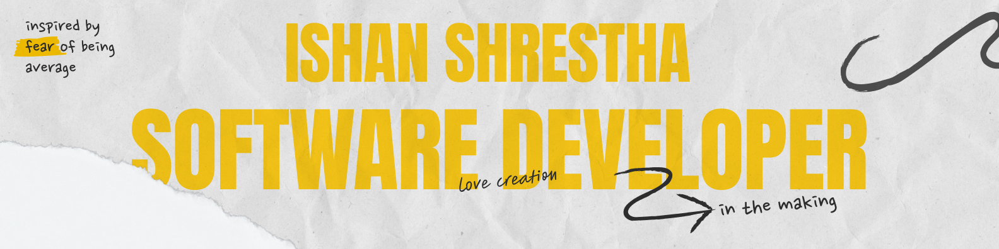

<!-- Banner -->

  

### Hi there! 

I'm Ishan, an aspiring software developer based in Nepal.

I enjoy turning ideas into working products — fast. From e-commerce platforms to AI-powered apps, my projects live at the intersection of **software engineering, design thinking, and problem solving**.

### 🌱 Currently

Grinding **LeetCode (NeetCode 150)** → Graphs section 📊

### 📫 Connect

